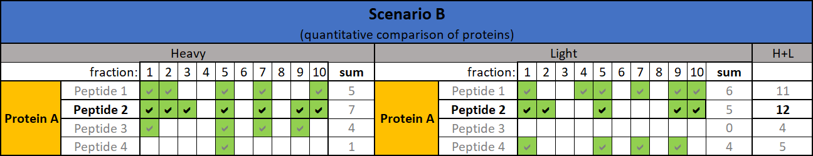
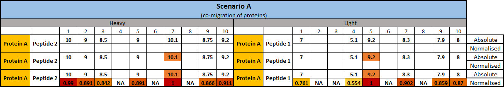
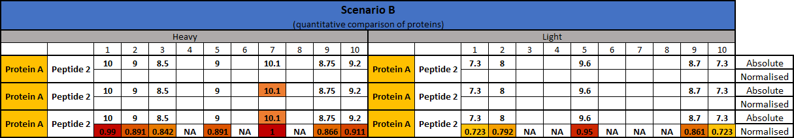

```{r setup, include = FALSE}
knitr::opts_chunk$set(
    fig.width=7, fig.height=4.5, 
    collapse = TRUE,
    eval = TRUE,
    comment = "#>"
)
```

# Introduction

Complexome profiling or complexomics is a mass spectrometry based method used 
in biology to study macromolecular complexes in their native form. 
Protein complexes are assessed
by evaluating their migration profile across a range of fractions. 
First, lysed protein sample is separated into fractions, typically by blue 
native electrophoresis (BN-PAGE) or density gradient centrifugation. Individual
fractions are analysed by mass spectrometry. This allows to identify protein
migration profiles across the fractions and to assess protein co-migration. 
It is often desirable to compare co-migration between multiple biological 
samples. Typically, this would require analysing each sample separately, 
using multiple
lanes of blue native gel/multiple gradients. This might introduce technical
biases making the qualitative comparison of migration profiles as well as 
quantitative comparison of protein amount between different biological samples 
difficult. To mitigate these technical biases, biological sample can be labeled 
by means detectable by mass spectrometry (e.g. SILAC, TMT, iTRAQ). 
Metabolic labeling in culture (SILAC) allows for sample multiplexing at the very
early steps of experiment, making it a useful tool when experimental design 
requires comparison of 2 biological samples. 

Here we present a ComPrAn (Complexome Profiling Analysis) R package to analyse 
data produced by SILAC complexomics experiments. This package does not interpret
raw mass spectrometry data. As an input it takes a table of peptides that were
identified by search engines such as Mascot, and quantified, e.g. in Proteome 
Discoverer.

This package allows to estimate protein intensities from peptide intensities, 
produces a normalized migration profiles of proteins through fractions, performs
cluster analysis and contains tools for visualization of results. The analysis 
is indented for samples that were SILAC labelled, therefore the input file 
should contain both "heavy" and "light" peptides.

## Method description

Below, we provide an overview of the method. We suggest 
**two possible uses of the package**. Here, we describe a **full workflow**,
describing analysis starting from the peptide information. Second option is 
to use only **protein workflow** described in a separate vignette. The second
workflow would include only steps 3) and 4) from below. It provides greater 
flexibility, for example, when only normalised protein values are available
or if different approach of estimation of protein intensities
from peptide intensities and/or for normalisation are required.

### 1) Estimation of protein intensities from peptide intensities

In mass spectrometry analysis multiple peptides are detected for each protein.
During initial data processing peptides are identified, assigned to proteins and
quantified. In a single sample, quantities of different peptides belonging to 
the same protein might differ. Differences in detected peptide quantities might
be caused by different efficiency of peptides ionization, peptide charge state,
modifications etc. There are many possibilities how to estimate a protein 
quantity from peptide quantity, we can take minimum/average/maximum of the 
quantities of all peptides that belong to this protein or we can do the same 
for a subset of peptides.

In complexomics, protein quantity values are compared among large number of 
fractions (typically 64 for BN-PAGE and ~20 for gradient centrifugation). 
Usually, not all the same peptides are detected for any given protein in all 
fractions. To make sure that protein quantification values used by the ComPrAn
package are comparable between fractions and between two label states, we pick 
a single representative peptide for each protein. Selected peptide must have the
same sequence, modifications and charge state across fractions where it was
detected. The most abundant peptide for each protein is picked as the 
representative peptide.

Based on the experimental question asked, we use two scenarios to select a 
representative peptide:

* **Scenario A** - *Which proteins co-migrate together within one label state?*
*Does the migration profile for a protein differ between label states?*  
In scenario A, we firs split peptides into 2 groups, unlabeled and labelled, 
and then pick a representative peptide as the one that is present in the highest
number of fractions within each label state (maximum possible value is the total
number of fractions). This means that for any single protein the 
**peptide that is picked for labelled sample may be different**
**from the peptide selected for unlabeled sample**. This scenario picks 
representative peptide for all proteins, even if they are present only in one 
label state. 
{width=650px}
**Fig 1** *Schematic of example case of representative peptide selection for*
*Heavy and Light samples according to*
*scenario A. Green ticked boxes mean that a given peptide was detected in a*
*given fraction. Peptide present in highest number of fractions, separately*
*for each label state is selected (Peptide 2 for Heavy, Peptide 1 for Light)*

* **Scenario B** - *Does the quantity of a protein differ between label states?*
In scenario B, we pick the representative peptide as the one that is present in 
the highest number of fractions, together for both label states 
(maximum = 2x number of fractions). This means that for any single protein the 
**representative peptide that is picked for**
**labelled sample and unlabeled sample are the same**. This scenario picks 
representative peptide only for shared peptides.
{width=650px}
**Fig 2** *Schematic of example case of representative peptide selection for*
*Heavy and Light samples according to*
*scenario B. Green ticked boxes mean that a given peptide was detected in a*
*given fraction. Peptide present in both samples in the highest number of*
*fraction (column H+L) is selected as representative (Peptide 2)*

After selecting a representative peptide for scenarios A and B we produce a 
table containing only representative peptide values for each protein. 

### 2) Normalization of protein intensities

For easier comparison of protein co-migrations and quantities we normalize all 
protein quantity values to be between 0 and 1. Method of normalization differs
between scenarios:

* **Scenario A** - For each protein, the quantity value for each fraction 
is divided by the maximum value across all fractions *within one label state*. 
This means that
e.g. for *protein A* there will be a value of 1 present at least in one fraction
for unlabeled sample and at lease in one fraction for labelled samples. 
Because of the way how we select representative peptide and this normalization
*we do not advice to use scenario A*
*for quantitative comparison of proteins between label states*. Intended use of
scenario A is to compare co-migration of proteins. 
{width=720px}
**Fig 3** *Schematic of simplified case of normalisation according to*
*scenario A. First, fraction with highest value is identified, separately for*
*Heavy and Light samples. Next, value of each fraction is divided by this*
*maximum value.*

* **Scenario B** - For each protein, the quantity value for each fraction 
is divided by the maximum value across all fractions and *both label states*.  
This means that e.g. for *protein A* there will be a value of 1 present at least
in one fraction in at least one of labelled or unlabeled samples. 
Because of the way how we select representative peptide and this normalization
*we recommend using scenario B*
*for quantitative comparison of proteins between label states*. 
{width=720px}
**Fig 4** *Schematic of simplified case of normalisation according to*
*scenario B. First, fraction with highest value across both samples is*
*identified. Next, value of each fraction is divided by this*
*maximum value.*

### 3) Hierarchical clustering

Clustering allows to identify similarity between migration profiles of proteins
in an unbiased way. We can check co-migration of known protein complexes by
simply filtering the data, however, clustering provides additional information
by allowing to identify unknown proteins that show similar migration profile as
our proteins of interest.

This package contains functions to perform hierarchical clustering using Pearson
correlation (centered or uncentered) as a distance measure and one of the three
linkage methods (single, average or complete).

### 4) Export files and visualizations

We provide several functions to export intermediate steps of the analysis.
Plotting functionality includes: 

* allPeptidesPlot - scatter plot of all peptides that belong to a single protein
* proteinPlot - line plot for a selected protein 
* groupHeatMap - heatmap for a selected group of proteins 
* oneGroupTwoLabelsCoMigration - scatter plot for a selected group of proteins
* twoGroupsWithinLabelCoMigration - scatter plot for 2 selected groups of
proteins
* makeBarPlotClusterSummary - bar plot showing number of proteins per cluster

# Example full workflow

**Read in and filter data**
```{r}
library(ComPrAn)
inputFile <- system.file("extdata", "data.txt", package = "ComPrAn")
#read in data
peptides <- peptideImport(inputFile)
#mandatory filtering
peptides <- cleanData(peptides, fCol = "Search ID")
#optional filtering
peptides <- toFilter(peptides, rank = 1)
# separate chemical modifications and labelling into separate columns
peptides <- splitModLab(peptides) 
#remove unnecessary columns, simplify rows
peptides <- simplifyProteins(peptides) 

```

**Pick representative peptides for scenario A and scenario B**
```{r}
peptide_index <- pickPeptide(peptides)
```

**Have a look at all peptides for a protein (scatter plot)**
```{r}
protein <- "P52815"
max_frac <- 23
#example all peptide plot (default settings)
allPeptidesPlot(peptide_index,protein, max_frac = max_frac)
```


**Create a list of proteins present in both/only in one label state**
```{r}
listOnlyOneLabState <- onlyInOneLabelState(peptide_index)
```


**Extract values for representative peptides** for each protein, 
for both scenario A and scenario B.
Combine results into one data frame used in further analysis.
```{r}
# produce a data frame in a format needed for downstream analysis
forAnalysis <- getNormTable(peptide_index,purpose = "analysis")
# produce a data frame in an easily human readable format that can be exported
forExport <- getNormTable(peptide_index,purpose = "export")
```


**Have a look at a selected protein (line plot)**
```{r}
protein <- "P52815"
max_frac <- max(forAnalysis$Fraction)
# example protein plot, quantitative comparison between labeled and unlabeled
# samples (default settings)
proteinPlot(forAnalysis[forAnalysis$scenario == "B",], protein, max_frac)
```


**Make a heatmap for a selected group of proteins**
```{r groupHeatMap, fig.width=7, fig.height=6.7}
groupDataFile <- system.file("extdata", "exampleGroup.txt", package = "ComPrAn")
groupData <- data.table::fread(groupDataFile)
groupName <- 'group1'
# example heatmap, quantitative comparison between labeled and unlabeled samples
# (default settings)
groupHeatMap(dataFrame = forAnalysis[forAnalysis$scenario == "B",], 
                groupData, groupName)
```

**Co-migration plot of single protein group between label states**
```{r}
groupDataVector <- c("Q16540","P52815","P09001","Q13405","Q9H2W6")
groupName <- 'group1' 
max_frac <- max(forAnalysis$Fraction) 

# example co-migration plot, non-quantitative comparison of migration profile 
# of a single protein group between labeled and unlabeled samples 
# (default settings)
oneGroupTwoLabelsCoMigration(forAnalysis, max_frac = max_frac,
                                groupDataVector,groupName)

```

**Co-migration plot of two protein groups within label state**
```{r}
group1DataVector <- c("Q16540","P52815","P09001","Q13405","Q9H2W6")
group1Name <- 'group1' 
group2DataVector <- c("Q9NVS2","Q9NWU5","Q9NX20","Q9NYK5","Q9NZE8")
group2Name <- 'group2'
max_frac <- max(forAnalysis$Fraction) 

# example co-migration plot, non-quantitative comparison of migration profile 
# of two protein groups within label states (default settings)
twoGroupsWithinLabelCoMigration(dataFrame = forAnalysis, max_frac = max_frac, 
                                group1Data = group1DataVector, 
                                group1Name = group1Name,
                                group2Data = group2DataVector, 
                                group2Name = group2Name)
```

**Create components necessary for clustering:**
(distance matrix for labeled and unlabeled samples,
protein table for both samples)
```{r}
clusteringDF <- clusterComp(forAnalysis,scenar = "A", PearsCor = "centered")
```

**Assign clusters to data frames**
```{r}
labTab_clust <- assignClusters(.listDf = clusteringDF,sample = "labeled",
                                    method = 'average', cutoff = 0.85)
unlabTab_clust <- assignClusters(.listDf = clusteringDF,sample = "unlabeled",
                                    method = 'average', cutoff = 0.85)
```

**Make bar plots** summarizing numbers of proteins per cluster for labeled
and unlabeled samples
```{r clusterBar, fig.width=4, fig.height=2.5}
makeBarPlotClusterSummary(labTab_clust, name = 'labeled')
makeBarPlotClusterSummary(unlabTab_clust, name = 'unlabeled')
```

**Create table containing proteins and their assigned clusters**
```{r}
tableForClusterExport <- exportClusterAssignments(labTab_clust,unlabTab_clust)
```

<center>
#### *End of file*
</center>