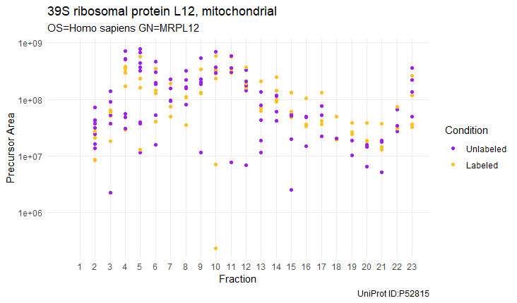
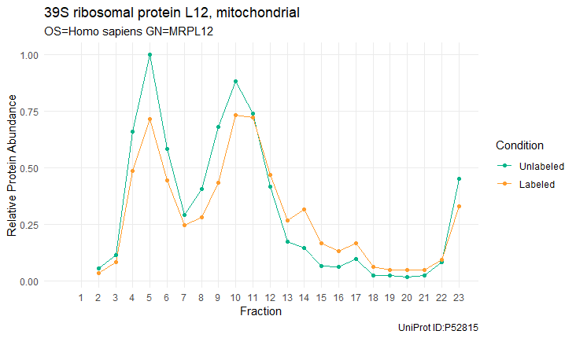
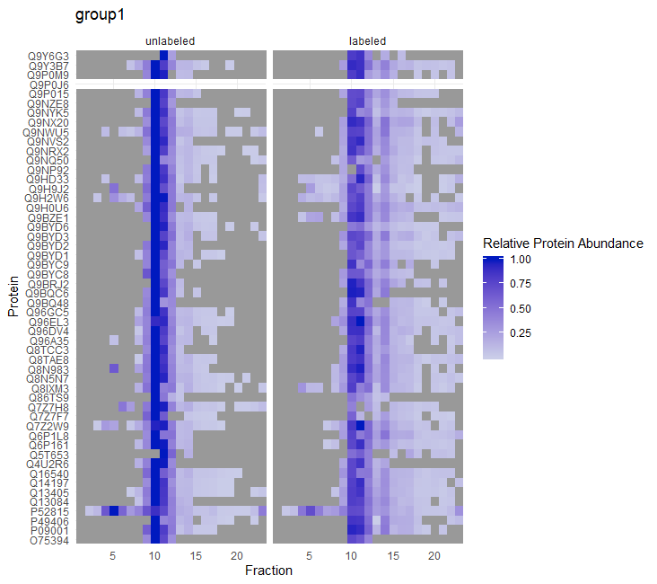
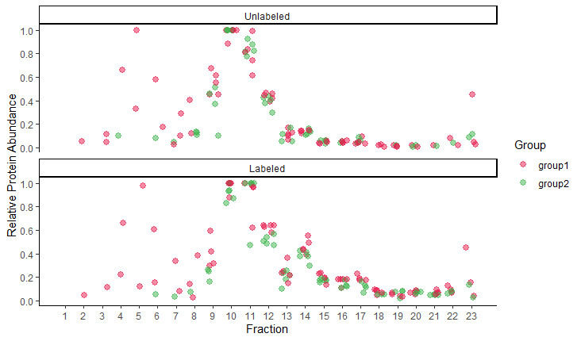
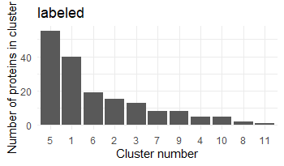
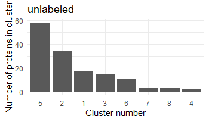

```{r setup, include = FALSE}
knitr::opts_chunk$set(
  collapse = TRUE,
  eval = FALSE,
  comment = "#>"
)
```

# Introduction

Complexome profiling or complexomics is a method used in biology to study migration profiles of proteins and protein complexes. First, sample is separated into fractions, typically by blue native electrophoresis or gradient centrifugation and individual fractions are analysed by mass spectrometry. This allows to identify proteins that co-migrate. Often people want to compare migration profiles and quantities of proteins between two biological samples. SILAC version of complexomics provides a useful tool for such studies. 

Here we present a package to analyse data produced by SILAC complexomics experiments. This package does not interpret raw mass spectrometry data. As an input it takes a table of peptides there were identified by search engines such as Mascot, and quantified, e.g. in Proteome Discoverer.

This package allows to estimate protein intensities from peptide intensities, produces a normalized migration profiles of proteins through fractions, performs cluster analysis and contains tools for visualization of results. The analysis is indented for samples that were SILAC labelled, therefore the input file should contain both 'heavy' and 'light' peptides.

### Method description

Below, we provide an overview of the method. We suggest **two possible uses of the package**. Here, we describe a **full workflow** which can be used when starting from the peptide information. Second option is to use only **protein workflow** described in a separate vignette. The second workflow would include only steps 3) and 4) from below. It provides greater flexibility for example if someone does not have access to peptide files but only to normalised protein values or if they wish to use different apporach for estimation of protein intensities from peptide intensities and/or for normalisation. 

#### 1) Estimation of protein intensities from peptide intensities

During mass spectrometry analysis many peptides are detected for each protein. During initial analysis peptides are identified, assigned to proteins and quantified. In a single sample, quantities of different peptides belonging to the same protein might differ. This is caused because different peptides ionize with different efficiency. Variation in detected quantities may be caused not only by differences in their sequence but also their charge state, modifications etc. There are many possibilities how to estimate a protein from peptide quantity, we can take minimum/average/maximum of the quantities of all peptides that belong to this protein or we can do the same for a subset of peptides.

In complexomics, we are comparing values among large number of fractions (typically 64 for BN-PAGE and ~20 for gradient centrifugation). Usually, we don't detect all the same peptides for any given protein in all fractions. We wanted to make sure that our protein quantification values are comparable between fractions and between two label states. Therefore, we decided to pick a single representative peptide for each protein. As the representative peptide we picked the most abundant peptide for each protein. 

Based on the experimental question asked, we used two scenarios to select a representative peptide:

* **Scenario A** - *Which proteins co-migrate together within one label state? Does the migration profile for a protein differ between label states?*  
In scenario A, we firs split peptides into 2 groups, unlabelled and labelled, and then pick a representative peptide as the one that is present in the highest number of fractions within each label state (maximum possible value is the total number of fractions). This means that for any single protein the **peptide that is picked for labelled sample may be different from the peptide selected for unlabelled sample**. This scenario picks representative peptide for all proteins, even if they are present only in one label state. 

* **Scenario B** - *Does the quantity of a protein differ between label states?*  
In scenario B, we pick the representative peptide as the one that is present in the highest number of      fractions, together for both label states (maximum = 2x number of fractions). This means that for any single protein the **representative peptide that is picked for labelled sample and unlabelled sample are the same**. This scenario picks representative peptide only for shared proteins. 

After selecting a representative peptide for scenarios A and B we produce a table containing only representative peptide values for each protein. 

#### 2) Normalization of protein intensities

For easier comparison of protein co-migrations and quantities we normalize all values to be between 0 and 1. Method of normalization differs between scenarios:

* **Scenario A** - For each protein we divide value for each fraction by the maximum value across all fractions *within one label state*.  This means that e.g. for *protein X* there will be a value of 1 present at least in one fraction for unlabelled sample and at lease in one fraction for labelled samples. Because of the way how we select representative peptide and this normalization *we do not advice to use scenario A for quantitative comparison of proteins between label states*, intended use of scenario A is to look at co-migration of proteins.  

* **Scenario B** - For each protein we divide value for each fraction by the maximum value across all fractions and *both label states*.  This means that e.g. for *protein X* there will be a value of 1 present at least in one fraction in at least one of labelled or unlabelled samples. Because of the way how we select representative peptide and this normalization *we recommend using scenario B for quantitative comparison of proteins between label states*. 

#### 3) Hierarchical clustering

Clustering allows to identify similarity between migration profiles of proteins in an unbiased way. We can check co-migration of known protein complexes by simply filtering the data, however, clustering provides additional information by allowing to identify unknown proteins that show similar migration profile as our proteins of interest.

This package contains functions to perform hierarchical clustering using Pearson correlation (cantered or uncentered) as a distance measure and one of the three linkage methods (single, average or complete).

#### 4) Export files and visualizations

We provide several functions to export intermediate steps of the analysis.
Plotting functionality includes: 

* allPeptidesPlot - scatter plot of all peptides that belong to a single protein 
* proteinPlot - line plot for a selected protein 
* groupHeatMap - heatmap for a selected group of proteins 
* oneGroupTwoLabelsCoMigration - scatter plot for a selected group of proteins
* twoGroupsWithinLabelCoMigration - scatter plot for 2 selected groups of proteins
* makeBarPlotClusterSummary - bar plot showing number of proteins per cluster

# Example full workflow

Read in and filter data
```{r}
inputFile <- system.file("extdata", "data.txt", package = "ComPrAn")
peptides <- cleanData(data.table::fread(inputFile), fCol = "Search ID") # read in + mandatory filtering
peptides <- toFilter(peptides, rank = 1) # optional filtering
peptides <- splitModLab(peptides) # separate chemical modifications and labelling into separate columns
peptides <- simplifyProteins(peptides) # remove unneccessary columns, simplify rows

```

Create and populate environment
```{r}
makeEnv(peptides)
```

Pick representative peptides for scenario A and scenario B
```{r}
for (i in names(peptide_index)) {
  assign(i, pickPeptide(peptide_index[[i]]), envir = peptide_index)
}
```

Have a look at all peptides for a protein (scatter plot)
```{r}
protein <- "P52815"
max_frac <- 23

allPeptidesPlot(peptide_index,protein, max_frac = max_frac)
```



Create a list of proteins present in both/only in one label state
```{r}
listOnlyOneLabState <- onlyInOneLabelState_ENV(peptide_index)
```


Extract values for representative peptides for each protein, for both scenario A and scenario B.
Combine results into one data frame used further down.
```{r}
names(peptide_index) %>%
  map_df(~ extractRepPeps(peptide_index[[.]], scenario = 'A', label = T))  %>% 
  normalizeTable() -> protNormLab

names(peptide_index) %>%
  map_df(~ extractRepPeps(peptide_index[[.]], scenario = 'A', label = F))  %>% 
  normalizeTable() -> protNormUnlab

names(peptide_index) %>%
  map_df(~ extractRepPeps(peptide_index[[.]], scenario = 'B')) %>% 
  normalizeTable() -> protNormComb

forExport <- normTableForExport(protNormLab, protNormUnlab, protNormComb) # file in nicely human readable format
forAnalysis <- normTableWideToLong(protNormLab, protNormUnlab, protNormComb) # file in format required for further analysis
```


Have a look at a selected protein (line plot)
```{r}
protein <- "P52815"
max_frac <- max(forAnalysis$Fraction)

proteinPlot(forAnalysis[forAnalysis$scenario == "B",], protein, max_frac)
```



Make a heatmap for a selected group of proteins
```{r}
groupData <- system.file("extdata", "exampleGroup.txt", package = "ComPrAn")
groupName <- 'group1'

groupHeatMap(dataFrame = forAnalysis[forAnalysis$scenario == "B",], groupData, groupName)
```



Co-migration plot of single protein group between label states
```{r}
groupDataVector <- c("Q16540","P52815","P09001","Q13405","Q9H2W6")
groupName <- 'group1' 
max_frac <- max(forAnalysis$Fraction) 

oneGroupTwoLabelsCoMigration(forAnalysis, max_frac = max_frac, groupDataVector,groupName)

```


Co-migration plot of two protein groups within label state
```{r}
group1DataVector <- c("Q16540","P52815","P09001","Q13405","Q9H2W6")
group1Name <- 'group1' 
group2DataVector <- c("Q9NVS2","Q9NWU5","Q9NX20","Q9NYK5","Q9NZE8")
group2Name <- 'group2'
max_frac <- max(forAnalysis$Fraction) 

twoGroupsWithinLabelCoMigration(dataFrame = forAnalysis, max_frac = max_frac, 
                                group1Data = group1DataVector, group1Name = group1Name,
                                group2Data = group2DataVector, group2Name = group2Name)
```


Extract data frames for clustering:
1) scenario A, isLabel == TRUE
2) scenario A, isLabel == FALSE
```{r}
forAnalysis %>% 
  as_tibble() %>% 
  filter(scenario == "A") %>% 
  select(-scenario) %>%
  mutate(`Precursor Area` = replace_na(`Precursor Area`, 0)) %>% 
  spread(Fraction, `Precursor Area`) -> forClustering

forClustering[is.na(forClustering)] <- 0

forAnalysis[forAnalysis$scenario == "A",] %>% 
  select(-scenario) %>% 
  spread(Fraction, `Precursor Area`) -> forClustering

forClustering[is.na(forClustering)] <- 0

labelledTable <- forClustering[forClustering$isLabel==TRUE,]
unlabelledTable <- forClustering[forClustering$isLabel==FALSE,]
```


Create distance matrix
```{r}
labDist <- makeDist(t(select(labelledTable,-c(1:3))), centered = T)
unlabDist <- makeDist(t(select(unlabelledTable,-c(1:3))), centered = T)
```


Assign clusters to data frames
```{r}
labelledTable_clust <- assignClusters(labelledTable, labDist,method = 'average', cutoff = 0.85)
unlabelledTable_clust <- assignClusters(unlabelledTable,unlabDist ,method = 'average', cutoff = 0.85)
```

Make bar plots summarizing numbers of proteins per cluster
```{r}
makeBarPlotClusterSummary(labelledTable_clust, name = 'labeled')
makeBarPlotClusterSummary(unlabelledTable_clust, name = 'unlabeled')
```
<center>
 
</center>

Create table containing proteins and their assigned clusters
```{r}
tableForClusterExport <- exportClusterAssignments(labelledTable_clust,unlabelledTable_clust)
```

<center>
#### *End of file*
</center>