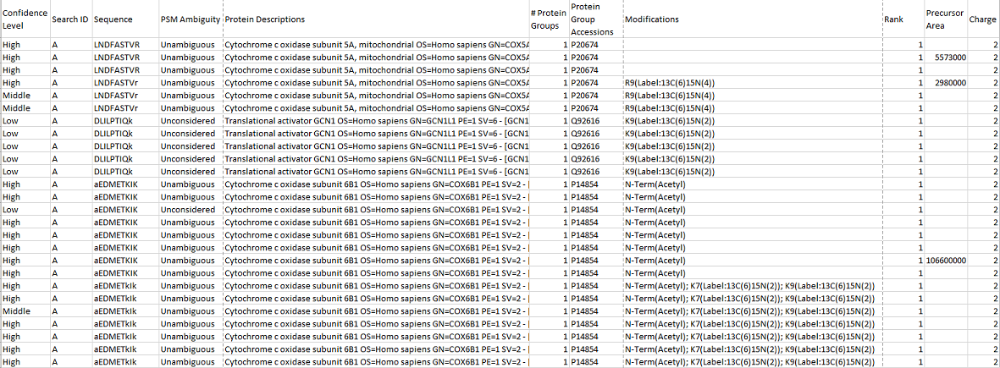
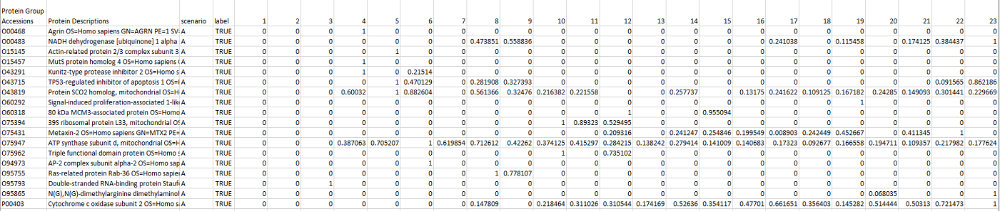

```{r setup, include = FALSE}
knitr::opts_chunk$set(
  collapse = TRUE,
  eval = FALSE,
  comment = "#>"
)
```
## Peptide input file
*system.file("extdata", "data.txt", package = "ComPrAn")* file in the example 
data set  
Input file needs to be a text file with tab deliminated values. Data are 
organized in a column format, first row contain column headers. 
This file must contain following columns, format of values inside each column
is also specified:   

* "PSM Ambiguity" - character/factor
* "Precursor Area" - numeric
* "# Protein Groups" - integer
* "Rank" - integer
* "Confidence Level" - character/factor
* "Protein Group Accessions" -  character/factor
* "Protein Descriptions" - character
* "Modifications" - character
* "Charge" - integer
* "Sequence" - character
* "Search ID" - character to be converted to integer

#### Description of columns

**"PSM Ambiguity"** - rows in which "PSM Ambiguity" value is "Rejected" will
be excluded from analysis

**"Precursor Area"** - column containing quantification of peptides 

**"# Protein Groups"** - specifies to how many protein groups a specific peptide 
was assigned

**"Rank"** - Rank assigned to the peptide by the upstream programms used

**"Confidence Level"** - Confidence assigned to the peptide by the upstream 
programms used

**"Protein Group Accessions"** - UniProt IDs of proteins

**"Protein Descriptions"** - description of the protein, for proper 
functionality of plotting functions should contain "GN=" with gene name after 
the equal sign

**"Modifications"** - chemical modifications of the peptide, including labeling
by heavy amino acids, if a peptide has multiple modifications values should be 
separated by semicolon followed by space "; ", heavy amino acids should be noted
in a format containing word "Label" in its value

**"Charge"** - charge state of peptide

**"Sequence"** - amino acid sequence of peptide in single letter format

**"Search ID"** - column specifiyng fraction in a format where "A" means 
fraction 1, "B" fraction 2 and so on, for samples with more then 26 fractions 
the values continue as "AA" for 27, "AB" for 28 etc. By default, the name of 
this columns is "Search ID" but a different name can be specified when calling 'cleanData()' function

  

*Example peptide file was produced using Proteome Discoverer™ Software* (Thermo Scientific™)

## Normalised proteins input file
*dataNormProts.txt* file in an example data set  
Input file needs to be a text file with tab deliminated values. Data are 
organized in a column format, first row contain column headers. 
This file must contain following columns, format of values inside each column 
is also specified:   

* "Protein Group Accessions" -  character/factor
* "Protein Descriptions" - character
* "scenario" - character/factor
* "label" - logical
* columns "1" to "n" - numeric, n represents total number of fractions in sample


#### Description of columns

**"Protein Group Accessions"** - UniProt IDs of proteins

**"Protein Descriptions"** - description of the protein, for proper 
functionality of plotting functions should contain "GN=" with gene name after 
the equal sign

**"scenario"** - A or B, specifies whether the values in any given row belog to
"scenario A" or "scenario B", meaning of these two scenarios is described in the SILACcomplexomics vignette

**"label"** - specifies whether the values in any given row belog to "labeled"
(=TRUE) or "unlabeled"(=FALSE) sample

**columns "1" to "n"** - n represents total number of fractions in sample, each row contains normalised intensity values for a given protein in a given fraction


